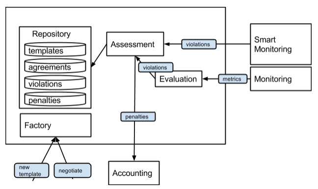
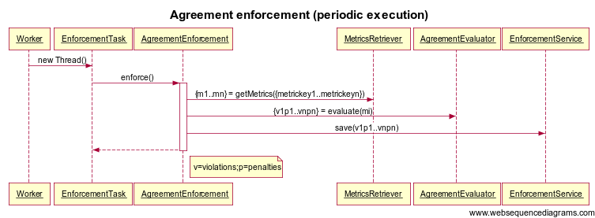
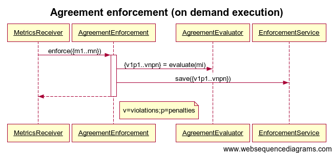
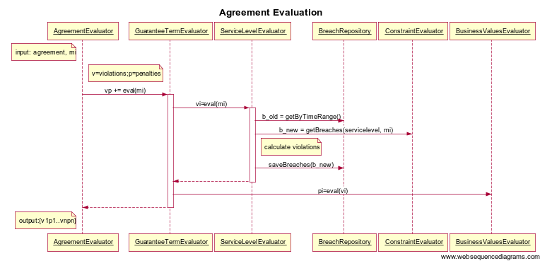

# SLA Core Developer Manual #

## Architecture ##

The sla-core must be flexible enough to work with the different 
monitoring systems available:

* Simple monitoring systems that must be polled in order to retrieve 
  the metrics.
* Monitoring systems that are able to push the metrics into the sla core
  once the are available.
* Smart monitoring systems that are able to evaluate the constraints, and 
  raise the appropriate violations

## Main classes ##

The following description depicts the main entities and terms
that are in the spec and the way they are related.

* A Provider offers a Service: a software service, hardware resources, etc.
* The service is described by ServiceDescriptionTerms with a Domain Specific 
  Language. The ServiceDescriptionTerms are intended to define a service that 
  has to be provisioned. This sla module needs external provision.
* The service is represented by a Template, and the Template can be used to 
  generate an Agreement.
* An agreement is a "document" that associates a Service and a Consumer. 
  When the relation is in negotiation-phase, it's called an AgreementOffer. 
  Once the agreement is accepted, it's called a Contract (this name is not 
  used by the spec).
* A Template and an Agreement can describe some restrictions (DSLed) to be 
  fulfilled by the Consumer or by the Provider.
* A violation of any restriction generates a Violation.

The WS-Agreement xml specifies in the context element who is the provider and 
the consumer, with the elements:

* AgreementInitiator (some kind of initiator identifier; OPTIONAL), 
* AgreementResponder (some kind of responder identifier; OPTIONAL),
* ServiceProvider ( = AgreementInitiator | AgreementResponder)

Usually, the consumer is the initiator. Although ws-agreement specifies 
AgreementInitiator/Responder as optional, it is recommended to specify them. 
In case of a multi-provider configuration, the SP MUST be specified.

## Agreements ##

Every entity is identified internally (to the sla-core) with autoincremented 
ids. Every entity that need identification outside the sla-core will be 
identified by an uuid if the entity is created internally. If the entity 
is created externally, it is not mandatory to be an uuid, but unique.

### Providers ###

The Providers API defines the ProvidersRepository and the CRUD operations 
to be called by the sla module user in the case of a multiprovider environment. 
If the sla is sticked to only one provider, this should be created once 
in module initialization.

## Enforcement ##

The enforcement is the process by which it is evaluated that the provider 
complies with an agreement, i.e. the measured metrics for the variables 
in guarantee terms fulfill the constraints. The sla-core must be flexible 
enough to work with the different monitoring systems available:

* Simple monitoring systems that must be polled in order to retrieve the 
  metrics.
* More complex monitoring systems that push new metrics to observers
  (in this case, the sla core).
* Smart monitoring systems that are able to evaluate the constraints, 
  and raise the appropriate violations.

The current enforcement implementation is able to work with the first two 
monitoring systems, while a bit of customization is needed to be utilized 
with the third one.

The enforcement process is depicted in the following sequence diagrams:

The job of each class is the following:

* AgreementEnforcement: retrieves the metrics needed to enforce an agreement 
  (if periodic enforcement execution), calls the AgreementEvaluator and 
  saves the detected violations and compensations in repository.
* AgreementEvaluator: calls the GuaranteeTermEvaluator for each guarantee 
  term in the agreement.
* GuaranteeTermEvaluator: calls the ServiceLevelEvaluator, obtaining the 
  raised violations; calls the BusinessValuesEvaluator using the violations 
  as input.
* ServiceLevelEvaluator: calculates the violations. The implemented evaluator 
  uses the concept of policy, where a number of violation metrics (a breach) 
  must occur in a period of time (specified in the policy) to raise a 
  violation. More details below.
* ConstraintEvaluator. Parses the service level constraint, and evaluates if 
  a metric fulfills the constraint.
* MetricsRetriever. Actively queries for the last metrics of an agreement. 
  Used in periodic execution.
* MetricsReceiver. Passively receives the last metrics of an agreement. 
  Used in on-demand execution. The frontend for the receiver can be a REST 
  service, a Message Queue, etc.

### Metrics Retriever ###

It's very likely that the monitoring system is independent from the SLA module.
For this reason, the ServiceProvider has to implement an adapter in order to 
the SLA retrieve the metrics needed to do the enforcement.

The ServiceProvider has to implement one of the following interfaces in its 
adapter to the monitoring system:

	public interface IMetricsRetriever {
		public List<IMonitoringMetric> getMetrics(
			String agreementId, 
			String serviceScope, 
			String variable, 
			Date begin, 
			Date end, 
			int maxResults);
	}
	
	public interface IMetricsRetrieverV2 {
		
		public interface RetrievalItem {
			IGuaranteeTerm getGuaranteeTerm();
			String getServiceScope();
			String getVariable();
			Date getBegin();
			Date getEnd();
		}
	
		public Map<IGuaranteeTerm, List<IMonitoringMetric>> getMetrics(
			String agreementId, 
			List<RetrievalItem> retrievalItems, 
			int maxResults);
	}

### Constraint Evaluation ###

A simple constraint definition and evaluation is implemented, where a 
constraint can be defined by the following grammar:

	E -> id OP VALUELIST
	OP -> "GT" | "GE" | "EQ" | "LT" | "LE" | "NE" | "BETWEEN" | "IN"
	VALUELIST -> "(" value "," value ")"
	VALUELIST -> value

Only float values are allowed.

For example, the following constraints are valid:

	responsetime LT 200
	availability EQ 1
	voltage BETWEEN (4.5, 5.5)
	status IN (200, 204)

A constraint is satisfied if a metric evaluate the condition to true. 
Otherwise, the metric is considered as a Breach.

If any sla provider wants to substitute the default constraint evaluation, 
the interface to implement is the following:

	public interface IConstraintEvaluator {
		
		List<IMonitoringMetric> evaluate(
			String kpiName, String constraint, List<IMonitoringMetric> metrics);
	
		String getConstraintVariable(String constraint);	
	}

* The getConstraintVariable() returns the metric name that has to be passed as 
  parameter to the monitoring adapter.
* The evaluate() function return which metrics are breaches in the list passed 
  as parameter.

### Aggregated values ###

Two types of metrics can be considered:

* Simple metrics. Each measure is a metric value.
* Aggregated metrics. The metric value is an aggregation of values using 
  an aggregation function. For example (using SQL syntax): SUM, AVG, COUNT... 
  The aggregated values makes sense within a time interval or number of 
  samples interval. As such, the interval must be implicit or explicitly 
  stated in the metric name. For example, a metric called "avg-uptime" 
  can be considered by the Monitoring System (or the adapter), the uptime per hour.

In this section it is explained how to evaluate aggregated values. Let's 
suppose that the constraint to satisfy is `avg-availability-3600`, being 
defined like this in the service level.

The most efficient and simple way to handle aggregated values it that the 
Monitoring System is ready for them. For example: the metric name 
`avg-availability-3600` can be interpreted by the Monitoring System as the 
avg availability of the last hour, and return the value accordingly. 
The monitoring adapter can perform a little name change if needed 
(e.g.: from `avg-availability-3600` to `AVG(availability, 3600)`).

The second place to handle aggregated values is in the monitoring adapter. 
The adapter have to take into account that the metric name starts with 
`avg-` (or whatever). Then, it queries the availability samples in the last 
hour, and calculates the average. It is less efficient than the first method, 
but it is still decoupled enough to be easily customizable and extendable.

The third place to handle aggregated values is in the ConstraintEvaluator 
itself. The reference implementation of ConstraintEvaluator calculates 
an average for variables 
that have the following syntax: `avg_<variable>_<timeinterval>`. The metric 
name to be passed to the monitoring adapter is `<variable>`.

### Complex constraints ###

It is a restriction of the SLA core that only one variable can be retrieved 
from the monitoring system per constraint (it greatly simplifies the 
implementation).

So, if it is needed to evaluate constraint of the type: 
`varA < value1 AND varB < value2`, this must be accomplished with the 
following approaches:

* Let the monitoring system evaluate the constraint, if it is able to do so.
* Let the monitoring adapter evaluate the constraint. For example, for the 
  previous constraint, `IConstraintEvaluator.getConstraintVariable()` can return 
  `varA_value1_AND_varB_value2`. The adapter interprets the variable, and makes 
  the appropriate evaluation, returning 1 or 0 for each tuple. The tuples must 
  be carefully handled, because the monitoring platform may not return the 
  values as tuples. It is advisable to use only aggregated metrics, as only one 
  value per variable is returned.
* Implement a ConstraintEvaluator that evaluates this kind of constraints. 
  The getConstraintVariable() must return the variables (f.e., as `varA,varB`).
  As the monitoring adapter returns only a list of MonitoringMetric (and not 
  a list of lists), the adapter can choose to:
	* "Zip" each tuple in a single MonitoringMetric, using, comma separated 
	values in the metric name and in the metric values. E.g.: a metric can 
	be `(name="var_a,var_b",value="1,0",time="2014-06-09 16:39")`. 
	* Use a MonitoringMetric for each variable. The ConstraintEvaluator has 
	to take metrics in groups of two.

### Policies ###

The policies used in C4S are an interesting feature not covered by the 
WS-Agreement. 

A policy is compound by:

* a date interval
* a number of occurrences

The objective of a policy is specify when to raise a violation. Instead of 
raise a violation on every constraint breach, it's raised when a number of 
breaches are found within the specified interval.

WS-Agreement does not make room to define something like a policy in a 
ServiceLevelObjective, so we are going to define the policy in the 
CustomServiceLevel, along with the constraint definition. So, it's proposed 
to define the CustomServiceLevel like this:

	{ 
	  policies: [ { count : 2, interval: 120 }, { count: 2, interval: 3600 } ],
	  constraint: "responsetime LT 100"
	}

So, if a service provider wants to offer policies in their SLA, they have to 
be compliant with this format. The constraint string is still totally domain 
defined.

### Business rules ###

A simple and generic implementation of business rules has been included in the core. Each guarantee term may 
have a BusinessValueList element where the penalties of not satisfying a guarantee term are defined.

The business structure defined in the wsag specification is not expressive enough for our purposes, so that
structure is basically ignored, and the implementation makes use of CustomBusinessValues to define the business rules
as a generalization of the standard penalties.

The recognized xml structure is:
	
	<wsag:BusinessValueList>
	  <wsag:Importance>xs:integer</wsag:Importance>?
	  <wsag:CustomBusinessValue count="xs:integer" duration="xs:duration">
	    <sla:Penalty 
	      type="xs:string" 
	      expression="xs:string"
	      unit="xs:string"
	      validity="xs:string"
	    />*
	  </wsag:CustomBusinessValue>*
	</wsag:BusinessValueList>

Count and duration attributes are optional. If not specified, this CustomBusinessValue applies at each
violation. Otherwise, it applies only if `count` violations occur in a `duration` interval of time.

The interpretation of every Penalty attribute is up to an external accounting module, but the intended meaning is:

* type: kind of penalty (f.e: discount, service, terminate)
* expression, unit: value of the penalty (f.e. discount of (50, euro), discount(100, %), service(sms))
* validity: interval of time where the penalty is applied

Each time a violation is generated, the enforcement calculates if a business rule must be applied. If so, the 
corresponding Penalty is saved, and passed to the notification component.

The parsing of the business value list is performed in the IModelConverter. If a project wants to use a different
xml structure, it can write the jaxb classes and a new BusinessValueListParser. The assignment of the parser to the
model converter is done in the applicationContext.xml. The class to assign is defined in the configuration.properties
file.

## Project personalization ##
It is possible to program some plugins that can be injected in the code and that will personalize the behavior of 
the SLA software. 

As it has been commented in the installation guide, several parameters can be configured through the 
configuration.properties. From these parameters we emphasize the following:

- *enforcement.constraintEvaluator.class*: a class that must implement 
	eu.atos.sla.evaluation.constraint.IConstraintEvaluator
- *enforcement.metricsRetriever.class*: a class that must implement 
	eu.atos.sla.monitoring.IMetricsRetriever
- *parser.json.agreement.class*: a class that must implement 
	eu.atos.sla.parser.IParser<eu.atos.sla.parser.data.wsag.Agreement> 
- *parser.json.template.class*: a class that must implement 
	eu.atos.sla.parser.IParser<eu.atos.sla.parser.data.wsag.Template> 
- *parser.xml.agreement.class*: a class that must implement 
	eu.atos.sla.parser.IParser<eu.atos.sla.parser.data.wsag.Agreement>
- *parser.xml.template.class*: a class that must implement 
	eu.atos.sla.parser.IParser<eu.atos.sla.parser.data.wsag.Template>

These classes are used for the enforcement and for parsing the serialized string into something wsag compliant.

The implementation of these classes should be done in the sla-personalization project. It is an empty code project 
that already imports the sla-enforcement, sla-repository and sla-tools, and is included in the war the has to be 
deployed. The pom.xml should be touched when a library is used that is not initially contemplated.
 
### Enforcement ###

#### Notifications
It is possible to, once results from the enforcement task have been recorded, to notify a class.

The code must be included in the sla-personalization project.  The new clas must implement the 
*IAgreementEnforcementNotifier* interface. It is defined as:

	public interface IAgreementEnforcementNotifier {
	
		void onFinishEvaluation(IAgreement agreement, Map<IGuaranteeTerm, GuaranteeTermEvaluationResult>  guaranteeTermEvaluationMap);
	}

The only existing method must be implemented by the class. It will receive the same data as it is recorded in the
database. It will receive the *agreement*, from where the agreementId or any other data can be retrieve. An 
the *guaranteeTermEvaluationMap* that has a type of *GuaranteeTermEvaluationResult* which is implemented as:

	public interface GuaranteeTermEvaluationResult {
		
		List<IViolation> getViolations();
		List<? extends ICompensation> getCompensations();
	}

The information of the violations and compensations can be retrieved. 

### Parsing ###

To implement a new parser, it doesn't matter if it's for and Template, an Agreement, for JSON or XML format, the class 
must extend from the *eu.atos.sla.parser.IParser*.

	public interface IParser <T> {
  		/*
	   	* getWsagObject receives in serializedData the object information in an xml, json or any other format 
	   	* and must return the T object (eu.atos.sla.parser.data.wsag.Agreement or an 
   		* eu.atos.sla.parser.data.wsag.Template)
   		*/
   		public T getWsagObject(String serializedData) throws ParserException;
	
   		/*
    	* getWsagAsSerializedData receives in serializedData the object information in an xml, json or any other 
    	* format and  must return information following and xml in wsag standard.
    	*/	
   		public String getWsagAsSerializedData(String serializedData) throws ParserException;
	
	   /*
	    * getSerializedData receives in wsagSerialized the information in wsag standard as it was generated with 
    	* the getWsagAsSerializedData method and returns it in a xml, json or any other format
    	*/
   		public String getSerializedData(String wsagSerialized) throws ParserException;
	}

Depending if it is configured in **parser.json** or **parser.xml** the serializedData variable from the methods 
will be in json or in xml format.

### Build the code ###
To build the source code:

- open a command window
- go to the root directory (the same level where you have the configuration.properties.sample file)
- type: **mvn -Dmaven.test.skip clean install**

The war file should be copied automatically to the tomcat.directory folder defined in the *configuration.properties* 
file.

## Appendix 1: Sequence diagrams source ##

### Periodic agreement enforcement ###

	title Agreement enforcement (periodic execution)
	
	Worker->EnforcementTask: new Thread()
	EnforcementTask->+AgreementEnforcement: enforce()
	AgreementEnforcement->MetricsRetriever: {m1..mn} = getMetrics({metrickey1..metrickeyn})
	AgreementEnforcement->AgreementEvaluator: {v1p1..vnpn} = evaluate(mi)
	
	AgreementEnforcement->EnforcementService: save(v1p1..vnpn)
	AgreementEnforcement-->-EnforcementTask:
	
	note right of AgreementEnforcement: v=violations;p=penalties

### On demand agreement enforcement ###

	title Agreement enforcement (on demand execution)
	
	MetricsReceiver->+AgreementEnforcement: enforce({m1..mn})
	AgreementEnforcement->AgreementEvaluator: {v1p1..vnpn} = evaluate(mi)
	
	AgreementEnforcement->EnforcementService: save({v1p1..vnpn})
	AgreementEnforcement-->-MetricsReceiver:
	
	note right of AgreementEnforcement: v=violations;p=penalties

### Agreement evaluation ###

	title Agreement Evaluation
	
	note left of AgreementEvaluator: input: agreement, mi
	note right of AgreementEvaluator: v=violations;p=penalties
	AgreementEvaluator->+GuaranteeTermEvaluator: vp += eval(mi)
	GuaranteeTermEvaluator->+ServiceLevelEvaluator: vi=eval(mi)
	ServiceLevelEvaluator->BreachRepository: b_old = getByTimeRange()
	ServiceLevelEvaluator->ConstraintEvaluator: b_new = getBreaches(servicelevel, mi)
	note right of ServiceLevelEvaluator: calculate violations
	ServiceLevelEvaluator->BreachRepository: saveBreaches(b_new)
	ServiceLevelEvaluator-->-GuaranteeTermEvaluator:
	GuaranteeTermEvaluator->BusinessValuesEvaluator: pi=eval(vi)
	GuaranteeTermEvaluator-->-AgreementEvaluator:
	
	note left of AgreementEvaluator: output:{v1p1..vnpn}

